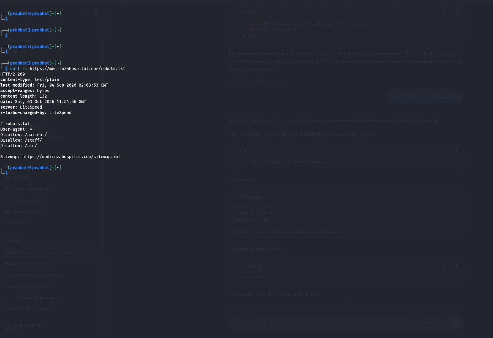
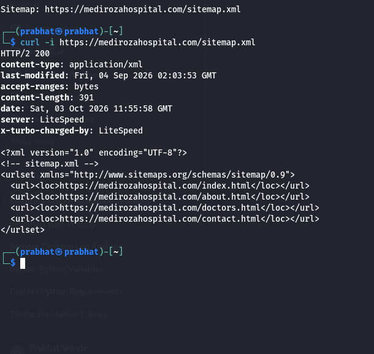
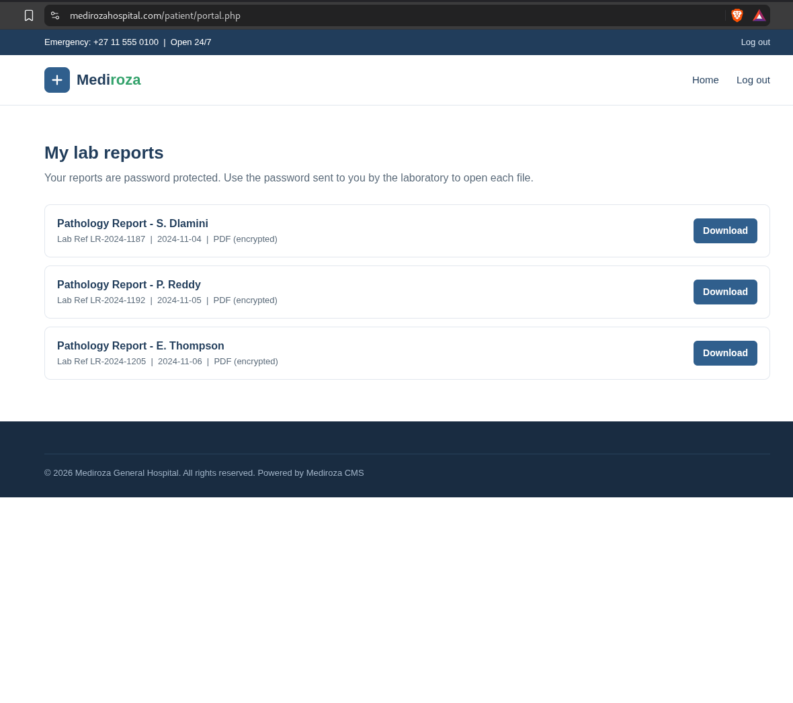
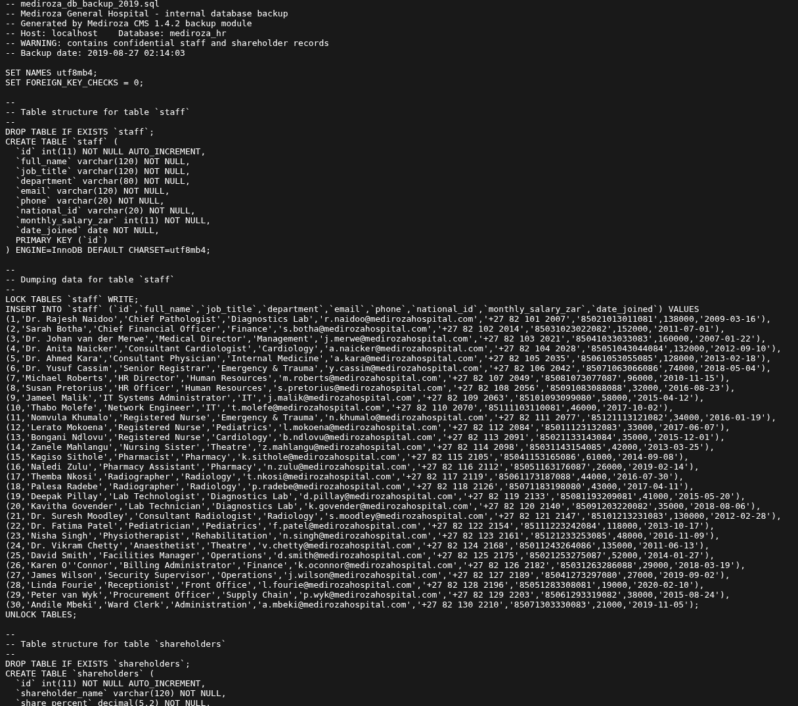

# Mediroza General Hospital — Web Application Penetration Test

<p align="center">
  
  
  
  
</p>

<p align="center">
  <b>NetworkWalks — Authorized Educational Security Assessment</b>
</p>

---

## 📌 Project Overview

This repository documents a **black-box web application penetration test**
performed against the authorized **Mediroza General Hospital** training
environment as part of a NetworkWalks security assessment exercise.

The assessment was structured across four milestones:

```text
M1 — Initial Access
        ↓
M2 — Data Extraction
        ↓
M3 — Critical Data Exposure
        ↓
M4 — Professional Penetration Testing Report
```

The objective was to approach the application from an external
attacker's perspective, identify vulnerabilities, demonstrate their
impact within the authorized environment, investigate the resulting
access, and document the findings professionally.

---

# 🎯 Engagement Information

| Item | Details |
|---|---|
| **Client** | Mediroza General Hospital |
| **Target** | `https://medirozahospital.com` |
| **Assessment Type** | Black-box Pentest |
| **Project Type** | Penetration Testing & Vulnerability Assessment |
| **Duration** | 5 Days |
| **Authorization** | Written authorization granted |
| **Environment** | Controlled educational environment |
| **Scope** | Target domain only |

---

# ⚠️ Authorization & Rules of Engagement

This project was conducted in a controlled environment for educational
purposes.

Written permission was granted to conduct security testing against the
target.

The project rules specified:

- Testing limited to the target domain only
- No social engineering
- No denial-of-service testing
- No testing outside the agreed scope
- Findings to remain confidential until the designated reveal session

> **Important:** The techniques documented in this repository must never
> be applied to any system without explicit written permission from the
> system owner.

Sensitive information from the exercise has been removed or redacted
from the public repository.

---

# 🧭 Assessment Methodology

The assessment followed an evidence-driven approach rather than simply
running a predefined list of tools.

```text
Reconnaissance
       ↓
Attack Surface Discovery
       ↓
Authentication Analysis
       ↓
Input Handling Testing
       ↓
Initial Access
       ↓
Document Analysis
       ↓
PDF Password Analysis
       ↓
Metadata Analysis
       ↓
Evidence Correlation
       ↓
Critical Data Exposure
       ↓
Professional Reporting
```

The reasoning process used throughout the assessment was:

```text
Observation
     ↓
Hypothesis
     ↓
Test
     ↓
Result
     ↓
Conclusion
     ↓
Next Hypothesis
```

---

# 🏁 Milestone 1 — Initial Access

## Objective

Attack the website and retrieve the **three confidential patient PDF
laboratory reports**.

The milestone required:

- Conducting reconnaissance
- Identifying exposed entry points
- Analysing authentication mechanisms
- Investigating user-input handling
- Gaining access to a restricted area
- Retrieving three patient PDF reports

---

## 1.1 Reconnaissance

The assessment began by examining publicly accessible resources.

The `robots.txt` file disclosed additional application paths:

```text
/patient/
/staff/
/old/
```

It also referenced the sitemap.

### Proof of Work — robots.txt



---

## 1.2 Sitemap Analysis

The sitemap was then examined to understand the publicly exposed
application pages.

The sitemap contained pages including:

```text
/index.html
/about.html
/doctors.html
/contact.html
```

### Proof of Work — Sitemap



The sitemap did not list the `/patient/`, `/staff/`, or `/old/`
directories identified through `robots.txt`.

This provided additional areas for investigation.

---

## 1.3 Authentication Analysis

The `/patient/` path led to the patient authentication functionality.

### Proof of Work — Patient Login



Different authentication responses were observed for different
usernames.

This behavior demonstrated **username enumeration**.

Further controlled testing of the login input identified SQL injection
behavior.

Within the authorized laboratory environment, the SQL injection
behavior was demonstrated to allow authentication bypass.

---

## M1 Result

The patient portal was successfully accessed within the authorized
exercise.

Three PDF reports were retrieved:

```text
patient_report_1.pdf
patient_report_2.pdf
patient_report_3.pdf
```

### M1 Deliverable

- Reconnaissance evidence
- Authentication testing evidence
- Proof of access
- Three retrieved patient PDF reports

**Status: ✅ Completed**

---

# 🔐 Milestone 2 — Data Extraction

## Objective

Crack the encryption on all three retrieved PDF files.

The project instructions required:

- Analysing the encryption of each file
- Selecting appropriate tools
- Selecting appropriate wordlists
- Recovering the contents
- Not assuming that one method would work for all three files

---

## 2.1 PDF Password Analysis Workflow

The workflow used for the encrypted reports was:

```text
Encrypted PDF
      ↓
PDF Encryption Analysis
      ↓
Extract Crackable Hash
      ↓
Select Wordlist
      ↓
Dictionary Attack
      ↓
Password Recovery
      ↓
Validate PDF Access
```

---

## 2.2 Report 1 — Hash Analysis

The first PDF was analysed to determine its encryption characteristics
and extract a crackable PDF hash.

### Evidence


The extracted hash was then tested against the available dictionary.

### Evidence — Password Recovery


The password was successfully recovered and the PDF could be opened.

---

## 2.3 Report 2 — Hash Analysis

The second PDF was independently analysed.

### Evidence


The extracted hash was then tested against the available dictionary.

### Evidence — Password Recovery


The password was successfully recovered.

---

## 2.4 Report 3 — Encryption Analysis

The third PDF was analysed separately.

### Evidence


A crackable PDF hash was extracted for password-recovery testing.

---

## 2.5 Report 3 — Initial Dictionary Attempt

The initial dictionary approach did not immediately recover the
password.

### Evidence


This demonstrated an important part of the methodology:

> One password-recovery approach does not necessarily work for every
> encrypted file.

The result led to the selection of another authorized wordlist.

---

## 2.6 Report 3 — Successful Recovery

The alternative dictionary approach successfully recovered the
password.

The recovered password was then used to validate access to the PDF.

> The recovered password is intentionally not reproduced in this public
> repository.

---

## M2 Results

| Report | Hash Analysis | Password Recovery | Result |
|---|---|---|---|
| Report 1 | ✅ Completed | ✅ Successful | PDF opened |
| Report 2 | ✅ Completed | ✅ Successful | PDF opened |
| Report 3 | ✅ Completed | ✅ Alternative approach required | PDF opened |

### M2 Deliverable

- Encryption analysed for all three PDFs
- Crackable hashes extracted
- Password recovery completed
- Successful access to all three files demonstrated

**Status: ✅ Completed**

---

# 🚨 Milestone 3 — Critical Data Exposure

## Objective

Find the critical data exposure on the client server.

The milestone required:

- Analysing everything retrieved so far
- Examining file properties
- Following a finding to a further server exposure
- Finding hospital employee salaries
- Finding shareholder details

This milestone demonstrated the importance of following evidence rather
than treating each discovery as an isolated finding.

---

# 3.1 PDF Metadata Analysis

After gaining access to the reports, the PDF properties were examined.

The third report contained metadata that provided information about
the application and an internal clue regarding a database backup.

### Proof of Work


The metadata contained information related to:

- Application/software information
- Document production
- Internal author information
- An internal comment referencing the `/old/` directory

---

## Observation

The PDF contained internal metadata that was not required for normal
external document distribution.

## Hypothesis

The metadata could provide information useful for further investigation.

## Result

The metadata provided a clue pointing toward the `/old/` directory.

---

# 3.2 `/old/` Directory Investigation

The `/old/` directory had already been discovered during reconnaissance.

The PDF metadata provided another reason to investigate the location.

The directory listing exposed a historical database backup:

```text
mediroza_db_backup_2019.sql
```

### Proof of Work



---

## Finding — Exposed Legacy Backup

A historical database backup was accessible through a publicly
accessible web directory.

Directory listing also made the backup visible.

### Potential Impact

An exposed database backup may disclose:

- Database structure
- Application information
- Personal information
- Credentials or secrets
- Historical organizational information

### Recommended Remediation

- Remove obsolete backups from the web root
- Store backups outside publicly accessible directories
- Disable directory listing
- Apply appropriate access controls
- Review legacy directories regularly

---

# 3.3 Database Backup Analysis

The exposed SQL backup contained database structures and records.

The `staff` table contained fields including:

```text
full_name
job_title
department
email
phone
national_id
monthly_salary
date_joined
```

The `shareholders` table contained information including:

```text
shareholder
share_percentage
shares_held
share_class
```

The assessment therefore demonstrated that the exposed backup was not
simply an empty or obsolete database structure.

It contained organizational and personal information.

---

# 3.4 Confidential Data Exposure

The exercise required identifying:

- Hospital employee salaries
- Hospital shareholder details

These records were identified during the authorized assessment.

However, the actual confidential records are **not reproduced in this
public GitHub repository**.

The following information has intentionally been excluded from the
public repository:

- Patient names
- Patient IDs
- Dates of birth
- Medical results
- Staff personal information
- National identification numbers
- Telephone numbers
- Email addresses
- Individual salaries
- Credentials
- Session tokens
- Recovered passwords
- Original database backup

The objective of this repository is to demonstrate the security finding,
methodology, and proof of work without unnecessarily publishing
confidential information.

---

## M3 Result

The investigation successfully connected:

```text
PDF Metadata
      ↓
/old/
      ↓
Database Backup
      ↓
Staff Information
      ↓
Shareholder Information
```

### M3 Deliverable

- Critical server exposure identified
- Database backup exposure validated
- Staff information exposure identified
- Shareholder information exposure identified
- Evidence correlated across multiple stages

**Status: ✅ Completed**

---

# 🔗 Evidence Correlation

One of the most important parts of this assessment was connecting
findings discovered at different stages.

The investigation developed as follows:

```text
robots.txt
    ↓
/patient/
/old/
    ↓
Patient Login
    ↓
Authentication Weakness
    ↓
Patient Reports
    ↓
PDF Analysis
    ↓
PDF Metadata
    ↓
Reference to /old/
    ↓
Directory Listing
    ↓
SQL Database Backup
    ↓
Staff / Shareholder Data
```

This demonstrates an important penetration-testing principle:

> A finding discovered during one phase can provide the hypothesis
> for the next phase.

The `/old/` directory was initially discovered during reconnaissance.
The PDF metadata later provided additional evidence connecting the
directory to the investigation.

---

# 📊 Vulnerability Findings

| # | Finding | Location | Risk |
|---|---|---|---|
| 1 | Username Enumeration | `/patient/login.php` | Medium |
| 2 | SQL Injection / Authentication Bypass | `/patient/login.php` | Critical |
| 3 | Patient Report Access | `/patient/reports/` | High |
| 4 | Weak PDF Passwords | Patient PDF reports | High |
| 5 | Sensitive PDF Metadata | `patient_report_3.pdf` | Medium |
| 6 | Exposed Legacy Backup / Directory Listing | `/old/` | Critical |
| 7 | Confidential Information Exposure | SQL database backup | Critical |

---

# 🛠️ Recommendations & Remediation

## Authentication

The login mechanism should:

- Use prepared statements
- Use parameterized SQL queries
- Validate user input server-side
- Avoid concatenating raw user input into SQL
- Implement proper error handling

---

## Authentication Error Messages

The application should return the same generic authentication message
for invalid usernames and passwords.

Example:

```text
Invalid username or password.
```

---

## Patient Documents

Patient documents should:

- Be stored outside the public web root
- Require authentication
- Require authorization checks for every document request
- Not be directly exposed through predictable public paths

---

## PDF Security

Where PDF encryption is required:

- Use strong unique passwords
- Avoid predictable passwords
- Avoid common passwords
- Avoid usernames and dates
- Protect encryption credentials appropriately

---

## PDF Metadata

Unnecessary metadata should be removed before documents are distributed
externally.

Internal usernames, software information, comments, and operational
information should not be unnecessarily embedded in externally
distributed documents.

---

## Backup Security

Database backups should never be stored inside publicly accessible
web directories.

Recommended controls include:

- Dedicated backup storage
- Access controls
- Encryption
- Backup retention policies
- Regular legacy-file reviews
- Disabled directory listing

---

# 📝 Milestone 4 — Professional Penetration Testing Report

## Objective

Produce a detailed penetration-testing report documenting the
engagement, findings, proof of exploitation, risk ratings, and
remediation recommendations.

The final report follows the required structure:

```text
01 — Executive Summary
02 — Scope and Methodology
03 — Findings and Proof of Exploitation
04 — Risk Rating
05 — Recommendations and Remediation
```

---

## Final Report

The complete professional penetration-testing report is available here:

📄 **[View the Full Penetration Testing Report](report/Mediroza-Penetration-Test-Report.pdf)**

The report contains:

- Executive Summary
- Scope
- Methodology
- Reconnaissance
- Authentication Testing
- Vulnerability Findings
- Proof of Exploitation
- Risk Ratings
- Recommendations
- Remediation
- Lessons Learned
- Authorization and Responsible Testing

**Status: ✅ Completed**

---

# 🧠 Key Lessons Learned

The biggest lesson from this assessment was that penetration testing is
not simply about running tools.

The investigation required continuously asking:

```text
What did I observe?
        ↓
What could explain it?
        ↓
How can I test that hypothesis?
        ↓
What did the result tell me?
        ↓
What should I investigate next?
```

The strongest example was the relationship between the PDF metadata
and the `/old/` directory.

The directory had already been discovered during reconnaissance, but
the metadata provided an additional clue that helped connect the
different stages of the investigation.

---

# 🧰 Skills Demonstrated

### Reconnaissance

- Web application reconnaissance
- `robots.txt` analysis
- Sitemap analysis
- Attack-surface discovery

### Web Application Security

- Authentication testing
- Username enumeration
- SQL injection identification
- Authentication-bypass validation
- Access-control analysis

### Document Security

- PDF encryption analysis
- PDF password recovery
- Dictionary attacks
- PDF metadata analysis
- Information disclosure analysis

### Security Investigation

- Evidence correlation
- Hypothesis-driven testing
- Legacy resource investigation
- Database backup analysis
- Sensitive-data exposure analysis

### Reporting

- Vulnerability documentation
- Risk classification
- Proof-of-work collection
- Remediation recommendations
- Professional penetration-testing reporting

---

# 📂 Repository Structure

```text
MEDIROZA-WEB-PENTEST/
│
├── docs/
│   └── penetration-test.md
│
├── proof-of-work/
│   │
│   ├── milestone-01-initial-access/
│   │   ├── login.png
│   │   ├── robots.png
│   │   └── sitemap.png
│   │
│   ├── milestone-02-data-extraction/
│   │   ├── pdf-password-analysis1.png
│   │   ├── pdf-password-analysis2.png
│   │   ├── pdf-password-analysis3.png
│   │   ├── pdf-password-analysis4.png
│   │   ├── pdf-password-crack1.png
│   │   └── pdf-password-crack2.png
│   │
│   └── milestone-03-critical-data-exposure/
│       ├── old-directory.png
│       └── pdf-metadata.png
│
├── report/
│   └── Mediroza-Penetration-Test-Report.pdf
│
└── README.md
```

---

# 📚 Project Documentation

### Detailed Technical Case Study

[**Read the complete technical penetration-test documentation**](docs/penetration-test.md)

### Professional Report

[**View the final penetration-testing report**](report/Mediroza-Penetration-Test-Report.pdf)

---

# ⚖️ Responsible Testing

This repository represents an authorized educational security assessment.

Sensitive information discovered during the exercise has intentionally
been excluded or redacted from the public repository.

The techniques documented here must only be used against systems where
explicit written authorization has been provided by the system owner.

---

# 👨‍💻 Author

**Prabhat Shinde**

Cybersecurity | Web Application Security | SOC | Backend Development
```

### Your GitHub will then render the evidence like this

The important part is that the paths are **relative to `README.md`**, and your actual folder names match them:

```text
README.md
   │
   ├── proof-of-work/milestone-01-initial-access/robots.png
   ├── proof-of-work/milestone-01-initial-access/sitemap.png
   ├── proof-of-work/milestone-01-initial-access/login.png
   │
   ├── proof-of-work/milestone-02-data-extraction/pdf-password-analysis1.png
   ├── proof-of-work/milestone-02-data-extraction/pdf-password-analysis2.png
   ├── proof-of-work/milestone-02-data-extraction/pdf-password-analysis3.png
   ├── proof-of-work/milestone-02-data-extraction/pdf-password-analysis4.png
   ├── proof-of-work/milestone-02-data-extraction/pdf-password-crack1.png
   ├── proof-of-work/milestone-02-data-extraction/pdf-password-crack2.png
   │
   ├── proof-of-work/milestone-03-critical-data-exposure/pdf-metadata.png
   ├── proof-of-work/milestone-03-critical-data-exposure/old-directory.png
   │
   └── report/Mediroza-Penetration-Test-Report.pdf

# mediroza-web-security-assessment
